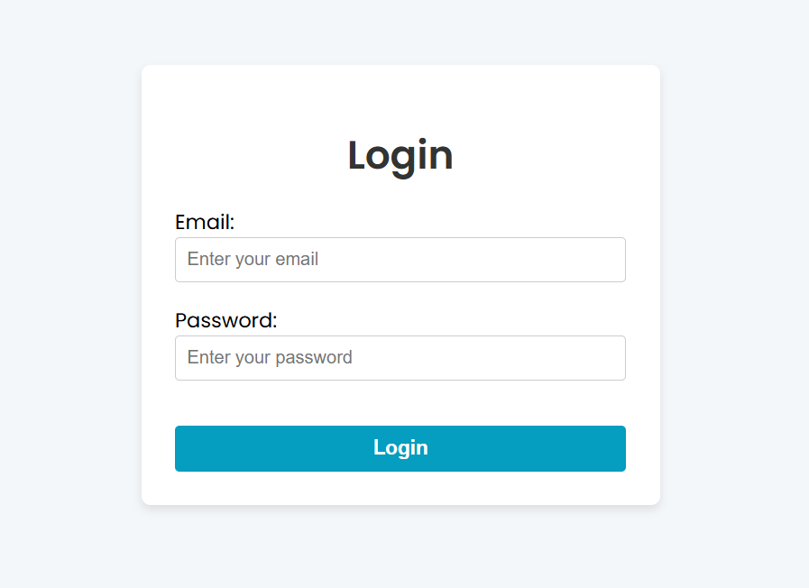
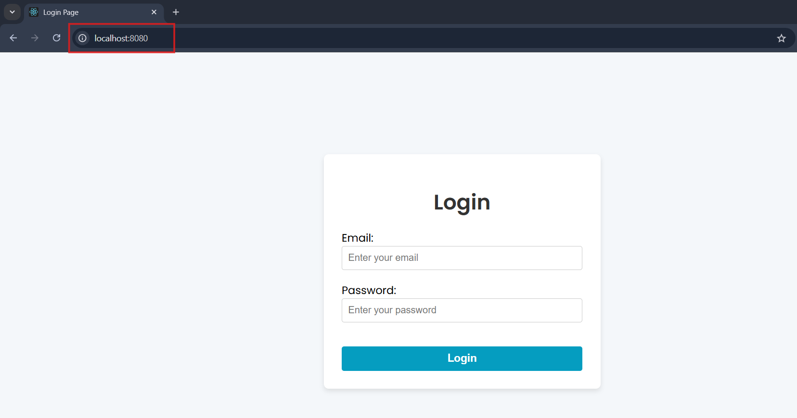
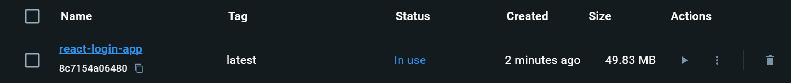

# Multi-stage-Dockerfile

## My Login Page



## Dockerfile

```dockerfile
# Stage 1: Build the React application
FROM node:18 AS build

# Set the working directory
WORKDIR /app

# Copy package.json and package-lock.json
COPY package*.json ./

# Install dependencies
RUN npm install

# Copy the source code
COPY . .

# Build the React application
RUN npm run build

# Stage 2: Create the production image
FROM nginx:stable-alpine AS production

# Copy the build files from the previous stage
COPY --from=build /app/build /usr/share/nginx/html

# Expose the default Nginx port
EXPOSE 80

# Start Nginx
CMD ["nginx", "-g", "daemon off;"]
```

## Build and Run Commands

#### 1. Build the Docker Image

```bash
docker build -t react-login-app .
```

#### 2. Run the Docker Container

```bash
docker run -d -p 8080:80 react-login-app
```

#### 3. Access the Application Visit `http://localhost:8080` in your browser.



## Final Image Size

The size of the final image is around 50 MB.

